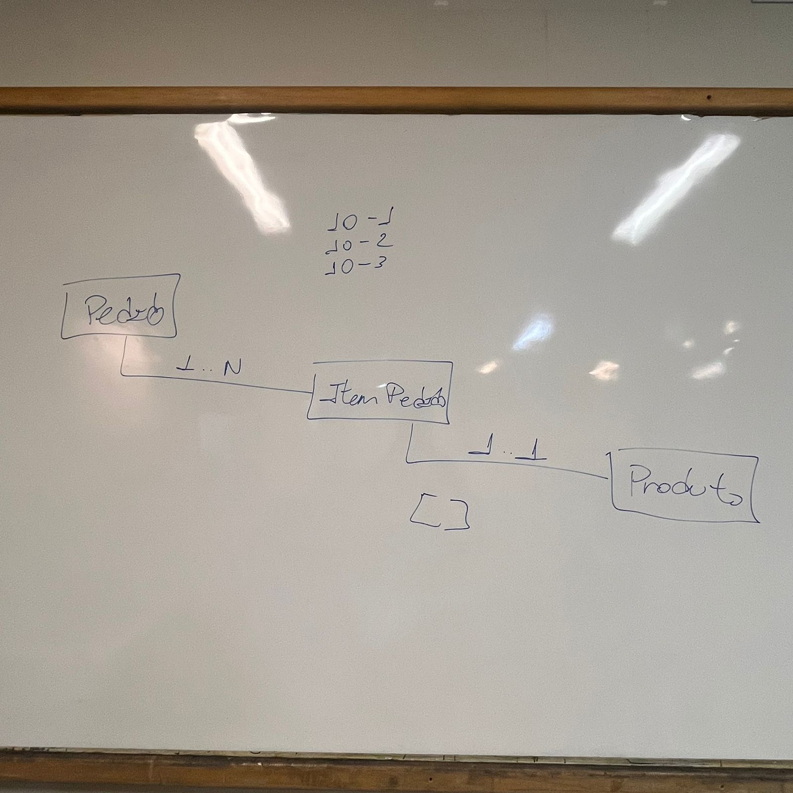

# TrabalhoA2

## Relação entre Entidades

A imagem abaixo representa a relação entre as entidades `Pedido`, `ItemPedido` e `Produto`, conforme discutido em sala de aula:

## Endpoints da API

A API expõe os seguintes endpoints para manipulação das entidades:

### Clientes
- `GET /clientes`: Retorna todos os clientes.
- `GET /clientes/{codigo}`: Retorna um cliente específico pelo código.
- `POST /clientes`: Cria um novo cliente.
- `PUT /clientes/{codigo}`: Atualiza um cliente existente.
- `DELETE /clientes/{codigo}`: Exclui um cliente.

### Fornecedores
- `GET /fornecedores`: Retorna todos os fornecedores.
- `GET /fornecedores/{codigo}`: Retorna um fornecedor específico pelo código.
- `POST /fornecedores`: Cria um novo fornecedor.
- `PUT /fornecedores/{codigo}`: Atualiza um fornecedor existente.
- `DELETE /fornecedores/{codigo}`: Exclui um fornecedor.

### Produtos
- `GET /produtos`: Retorna todos os produtos.
- `GET /produtos/{codigo}`: Retorna um produto específico pelo código.
- `POST /produtos`: Cria um novo produto.
- `PUT /produtos/{codigo}`: Atualiza um produto existente.
- `DELETE /produtos/{codigo}`: Exclui um produto.

### Pedidos
- `GET /pedidos`: Retorna todos os pedidos, incluindo os itens associados.
- `GET /pedidos/{codigo}`: Retorna um pedido específico pelo código.
- `POST /pedidos`: Cria um novo pedido.
- `PUT /pedidos/{codigo}`: Atualiza um pedido existente.
- `DELETE /pedidos/{codigo}`: Exclui um pedido.

### Itens de Pedido
- `GET /itenspedido`: Retorna todos os itens de pedido.
- `GET /itenspedido/{id}`: Retorna um item de pedido específico pelo ID.
- `POST /itenspedido`: Cria um novo item de pedido.
- `PUT /itenspedido/{id}`: Atualiza um item de pedido existente.
- `DELETE /itenspedido/{id}`: Exclui um item de pedido.

## Configuração do Banco de Dados
A aplicação está configurada para utilizar um banco de dados H2 em memória, simplificando a execução e testes. Durante a inicialização, dados de exemplo são automaticamente carregados, o que permite visualizar informações básicas na interface sem a necessidade de inserções manuais.

Arquivos importantes para a configuração:
Arquivo de configuração: application.properties
Local: A2/src/main/resources/application.properties
Este arquivo contém as configurações principais para o banco de dados e outras propriedades da aplicação.

Script de inicialização do banco de dados: data.sql
Local: A2/src/main/resources/data.sql
Este script SQL insere dados iniciais no banco de dados H2 durante a execução, facilitando os testes e a análise da aplicação.

Configurações padrão
Banco de dados: H2 em memória (jdbc:h2:mem:testdb)
Usuário: sa
Senha: (em branco)
Console H2: Habilitado para facilitar a visualização dos dados armazenados (/h2-console)
Com esses dados de configuração, basta executar a aplicação e acessar a URL do console H2 para verificar os dados carregados do script data.sql
